[🔥 Github的代码优先于Gitee   https://github.com/roinli/huige-ChargeOS-cloud](https://github.com/roinli/huige-ChargeOS-cloud)

原地址不明原因被禁用，该库为镜像项目

## 开源版本一定不会很完美，不过会一直持续更新，如果遇到任何问题请提issue或者加群沟通解决，谢谢。

当前版本：3.0.8

[🔥 充电平台微服务源码](https://github.com/roinli/huige-ChargeOS-cloud)

[🔥 充电管理后台前端源码](https://github.com/roinli/HUIZHI-ChargeOS-admin)

[🔥 充电小程序源码](https://github.com/roinli/HUIZHI-ChargeOS-mini)（当前）

##   小程序端 - （慧哥）慧知开源充电桩平台

    
    
     

# 小程序功能介绍

用户充电端为微信小程序，用于用户找桩、充电、查看订单、查看消费情况等

## 功能介绍

### 首页

首页可以按照距离、价格等排序进行充电站的列表展示，包含充电站名称、距离、充电价格、充电桩数量及停车信息等

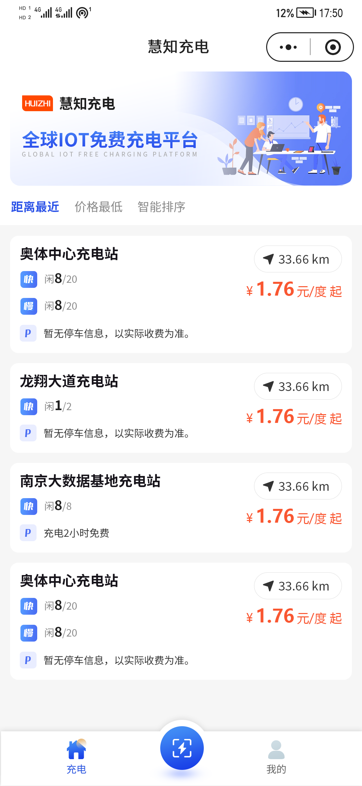

### 充电选择页

站点详情页选择空闲的充电桩，点击充电，可进入充电选择页面，在该页面选择设备端口和充电时长

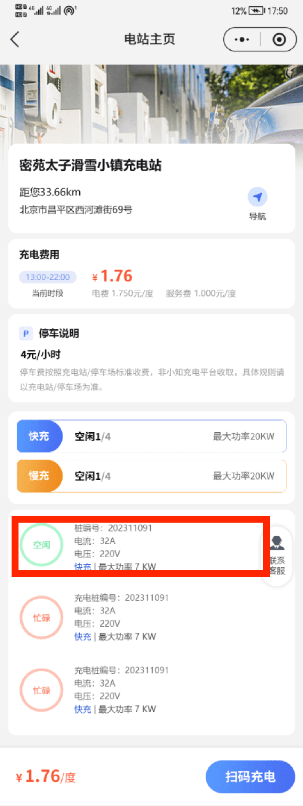

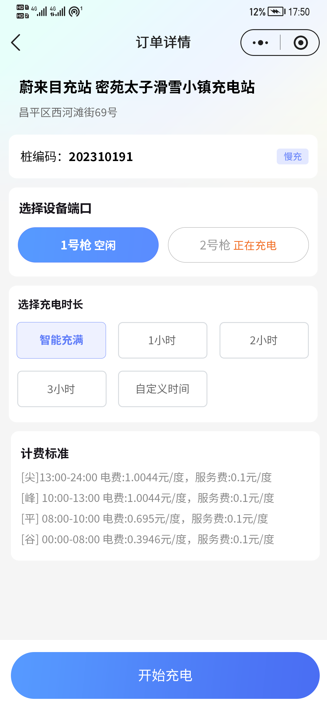

### 充电详情页

选择和设备端口和充电时长以后，点击开始充电，开始充电成功，进入充电详情页展示，获取实时充电动态数据，并可手动结束充电

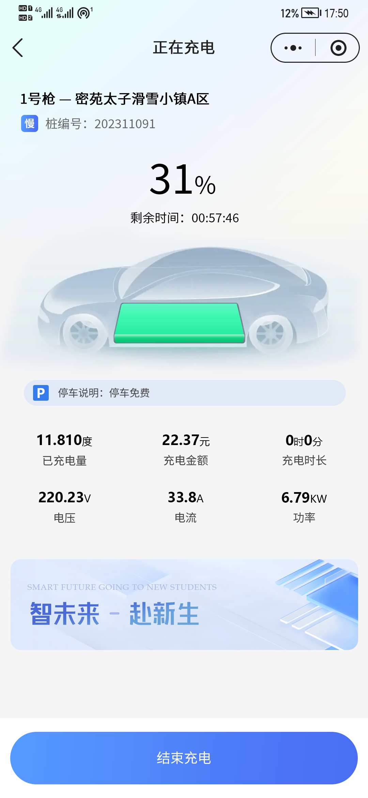

### 我的-首页

点击‘我的’按钮，进入用户主页，用户登录状态下显示当前登录用户的手机号、余额、代金券、积分及本月充电情况等基本信息

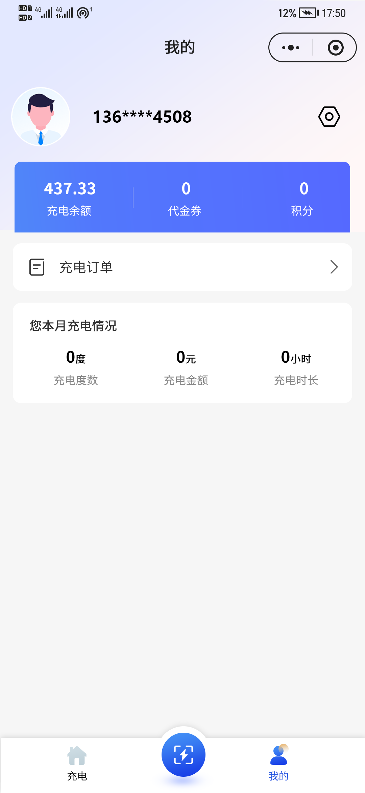

### 我的-订单列表

用户首页点击 我的订单 ，进入订单列表页，展示当前用户所有充电订单，可按照订单状态（进行中、已完成）进行搜索

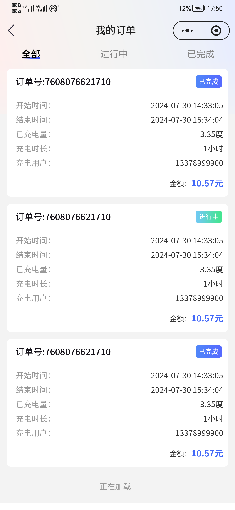

### 扫码充电

首页点击扫码按钮可扫码桩编码进行充电，扫描成功进入选择端口和充电时长页面

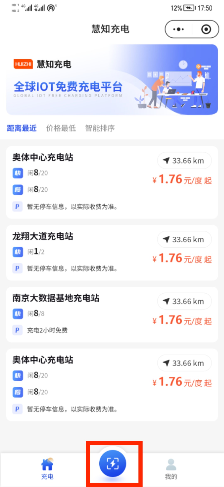

## 开发配置

### 配置小程序appid

使用hBuild打开项目源代码，选择manifest.json -> 微信小程序配置 -> 微信小程序appid
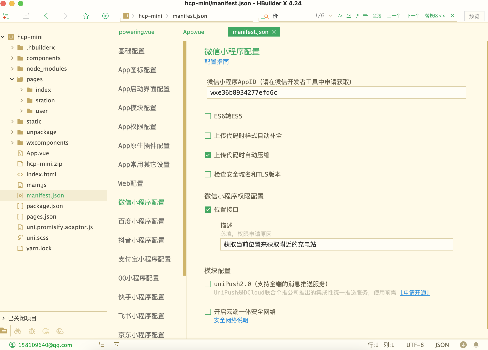

### 配置请求服务器地址和websocket地址

打开app.vue -> globalData -> 服务器接口地址：serverUrl, websocket地址：wsurl

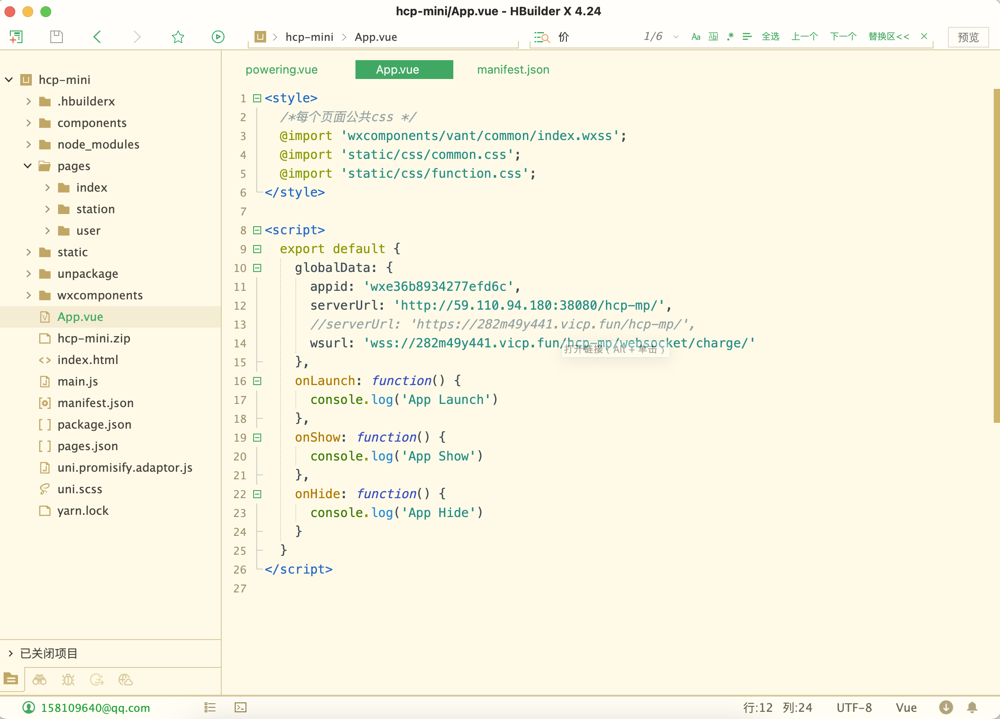

## 发布小程序

### 1.使用hBuild打开项目源码，点击工具栏中的运行->小程序模拟器->微信开发者工具

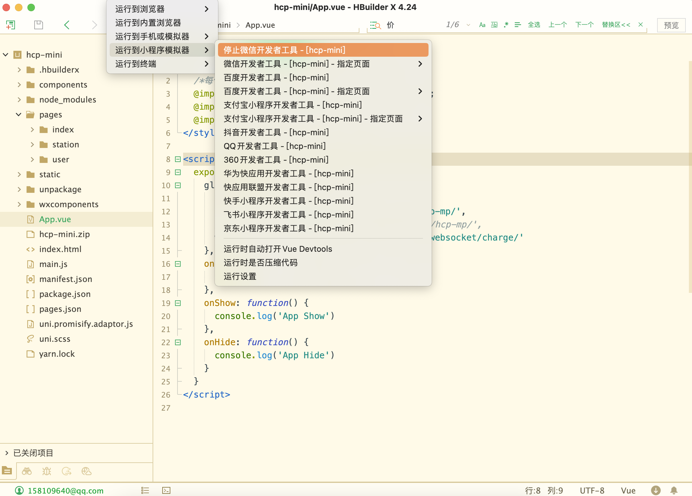

### 2.在打开的微信开发中工具中点击上传，输入版本号进行上传

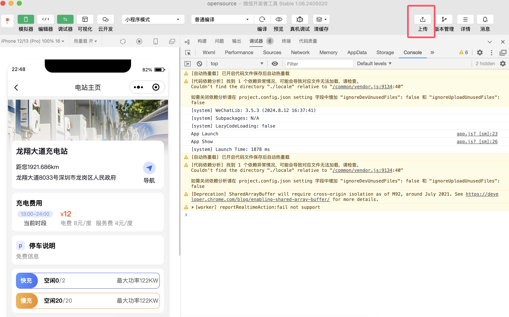

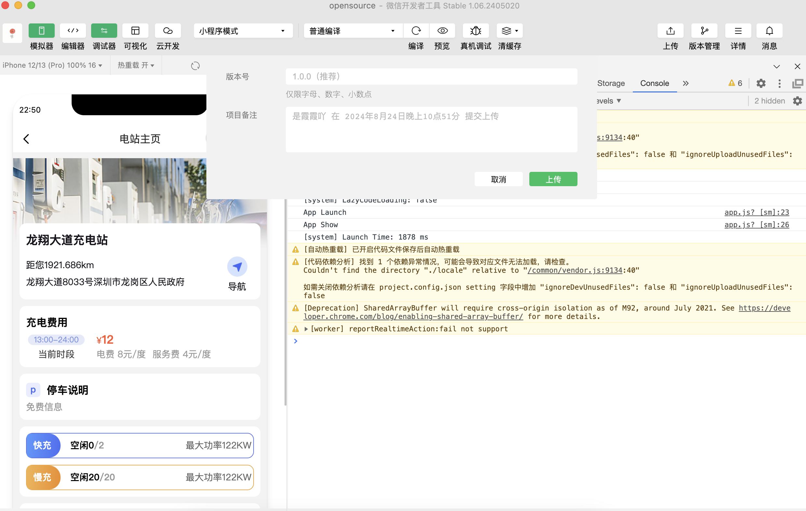

### 3.登录微信公众平台后台，在版本管理中，找到上传的版本，提交审核，完成发布

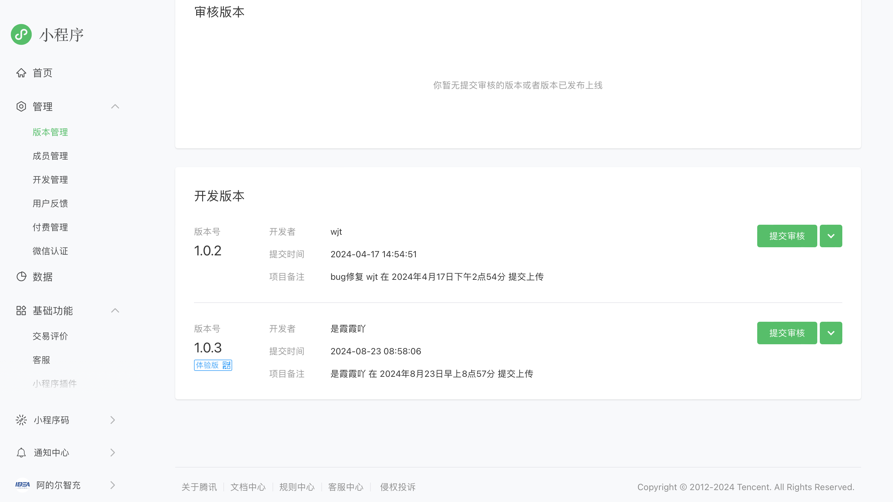
